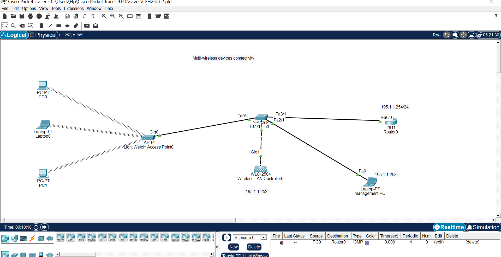
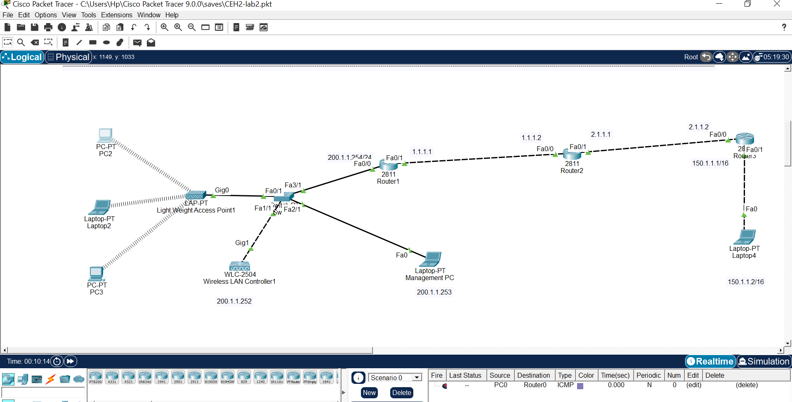

# Cisco Packet Tracer Labs

## Lab 2: Multi-Wireless Devices Connectivity

**File:** `CEH2-lab2.pkt`

### Topology Overview
This lab demonstrates multi-wireless device connectivity using a Cisco Wireless LAN Controller (WLC) and Lightweight Access Point (LAP) architecture, integrated with a multi-router WAN network.

---

### 🏠 Wireless LAN Section (195.1.1.0/24)

| Device | Model | Role | IP Address |
|--------|-------|------|------------|
| Router0 | Cisco 2811 | Gateway / DHCP / Routing | 195.1.1.254/24 |
| Switch | Cisco 2960 | Core switch | — |
| WLC-2504 | Wireless LAN Controller0 | Centralized wireless management | 195.1.1.252 |
| LAP-PT | Lightweight Access Point0 | Wireless access for clients | DHCP |
| Management PC | Laptop-PT | WLC management interface | 195.1.1.253 |
| PC0, PC1 | PC-PT | Wireless clients | DHCP |
| Laptop0 | Laptop-PT | Wireless client | DHCP |

---

### 🌐 WAN / Extended Network Section

| Device | Model | Interface | IP Address |
|--------|-------|-----------|------------|
| Router1 | Cisco 2811 | Fa0/0 | 200.1.1.254/24 |
| | | Fa0/1 | 1.1.1.1 |
| Router2 | Cisco 2811 | Fa0/0 | 1.1.1.2 |
| | | Fa0/1 | 2.1.1.1 |
| Router3 | Cisco 2811 | Fa0/0 | 2.1.1.2 |
| | | Fa0/1 | 150.1.1.1/16 |
| Laptop4 | Laptop-PT | Fa0 | 150.1.1.2/16 |

---

### 🔗 Connections

| From | To | Link Type |
|------|-----|-----------|
| LAP-PT Gig0 | Switch Fa0/1 | Wired (Trunk) |
| Switch Fa1/1 | WLC-2504 Gig1 | Wired |
| Switch Fa2/1 | Router0 Fa0/0 | Wired |
| Switch Fa3/1 | Router1 Fa0/0 | Wired |
| Router1 Fa0/1 | Router2 Fa0/0 | Serial/WAN |
| Router2 Fa0/1 | Router3 Fa0/0 | Serial/WAN |
| Router3 Fa0/1 | Laptop4 Fa0 | Wired |

---

### 📚 Key Concepts Covered
- ✅ Lightweight Access Point (LAP) registration to WLC
- ✅ Wireless LAN Controller (WLC) configuration
- ✅ Multi-device wireless connectivity
- ✅ Wired + wireless network integration
- ✅ Static routing between multiple routers
- ✅ WAN connectivity across 3 routers
- ✅ Different subnet communication (195.1.1.0/24 ↔ 200.1.1.0/24 ↔ 150.1.1.0/16)

---

### 🚀 How to Use
1. Open `CEH2-lab2.pkt` in **Cisco Packet Tracer 9.0.0** or later
2. Verify LAP registration status with WLC
3. Test wireless client connectivity to the internet/WAN
4. Verify end-to-end connectivity: PC0 → Router0 → Router1 → Router2 → Router3 → Laptop4

---

*Part of CEH (Certified Ethical Hacker) practical labs.*

### Screenshots
### Wireless LAN

### Full topology

